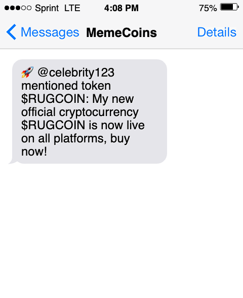

# Celebrity Memecoin Alert 🚀

# Subscribe to Deployed Version: 
https://memecoinannouncer.com

# Or Run Locally:

## Motivation
It seems I'm always late to hear about these celebrity meme coins. By the time I hear about them, it's already too late.
It would be nice to know about them right when they're announced without constantly checking online. This way, I can buy and sell a little bit before any potential rug pull.

This app monitors tweets from the most popular X (Twitter) users and notifies subscribers via email/text if the tweet contains an announcement of a new cryptocurrency (looking for $TOKEN patterns).

## Features
- Monitors tweets from top Twitter/X users in real-time
- Detects cryptocurrency token mentions ($TOKEN pattern)
- Supports both email and SMS notifications
- Rate limit handling with exponential backoff
- Easy to subscribe to notifications (TODO)

## Prerequisites
- Python 3.8+
- Twitter/X account credentials
- Twilio account (for SMS notifications)
- Gmail account (for email notifications)

## Installation

1. Clone the repository
```
git clone https://github.com/markliu22/MemeCoinAnnouncer.git
```

2. Install dependencies
```
pip install -r requirements.txt
```

3. Set up your Twitter credentials in `config.py` following the template in `config.template.py`

4. Add your information to subscribers in `app.py`

5. Review users_to_track.txt and add any users you want to monitor

6. Run the app
```
python app.py
```

7. Profit! Potentially... 

## Examples

### Text Message Notification



TMP
```
# Subscribe
curl -X POST http://localhost:5001/subscribe \
  -H "Content-Type: application/json" \
  -d '{"email": "user@example.com", "phone": "+1234567890"}'

# Unsubscribe
curl -X POST http://localhost:5001/unsubscribe \
  -H "Content-Type: application/json" \
  -d '{"email": "user@example.com"}'